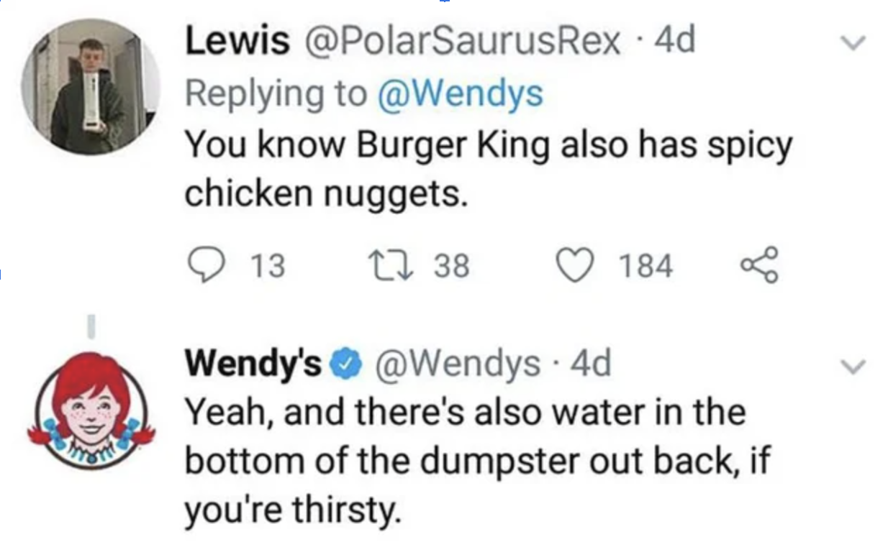

For decades, the Super Bowl has been more than a platform showcasing the NFL’s best two teams. Major companies have used the stage to launch high-budget, well-known advertisements that are talked about as much as the final score in offices around the world.

We are going to dive into the campaigns in years past that have stood the test of time and how they impacted a brands identity and future marketing efforts. We’ll also take a look at a few commercials from the 2023 game that have the potential to be considered legendary Super Bowl commercials for years to come.

Legendary Campaigns from Years Past:

## Wendy’s - Where’s the Beef (1984)

This Fast Food giant has been known in the 21st century for their social media team’s subtle jabs at competitors.

However, this is something the company has been doing for decades prior to the invention of Twitter. In 1984, Wendy’s aired an iconic Super Bowl commercial titled “Where’s the Beef?”. There are three elderly women looking at a massive bun but they’re confused because the proportion of meat to bun is a little off.

This was aimed at McDonald’s and their small patty to bun ratio for their burgers. The commercial helped the Fast Food staple to increase revenue by 31% in 84.

## Pepsi - Cindy Crawford (1992)

The pinnacle of Super Bowl commercials might just be Pepsi’s 1992 commercial that features Cindy Crawford and 2 young boys.

The only dialogue in the full one-minute ad comes from the young boys: “Is that a great new Pepsi can or what?” And the other responds: “It’s Beautiful”. Was he referring to the can?

The ad was so simple yet so effective. It was generated to target the youth in the middle of the cola wars with Coke in the 90’s. The ad is 30 years old now but still so iconic that it was recreated in 2021 by Crawford to raise money for the American Family Children’s Hospital.

## Snickers - You’re Not You When You’re Hungry (2010)

The delicious candy company introduced a slogan in 2010 that has stood the test of time with the help of the great Betty White.

In the commercial, Betty White is playing football with a group of way younger men. She is called to the sideline where she takes a bite of a snickers bar and quickly returns to her mid 30’s male form.

The company then introduced the slogan “You’re Not You When You’re Hungry” which has become the tagline of numerous commercials over the past decade plus.

Many companies since this ad success have used the massive Super Bowl platform to rebrand and launch new slogans, including last night.

Successful Campaigns from 2023 Super Bowl:

## Pringles - Get Stuck In

Pringles is an iconic chip company with a unique cylinder can shape that is exclusive to the brand.

With their 2023 ad, they decided to use that to their advantage. Anyone that enjoys the snack knows how difficult it is to get the last few chips out of the bottom and sometimes your hand will get stuck in the tin.

So the new slogan “Get Stuck In” was born. The full 30 second ad features various individuals, in different situations all with the iconic packaging stuck on their hand.

It was a great job by the company to use something unique to the brand in a comedic way that all Pringles lovers could relate to. It will be interesting to see if this slogan has the same success as Snickers.

## Dunkin’ Donuts - Ben Affleck & Jennifer Lopez

Dunkin’ Donuts fully invested in trends with this 30 second spot. The company put Actor Ben Affleck working the window of one of their donut shops in his home state of Massachusetts, something Cane’s has made popular in recent years.

The trends kept coming. After serving a few surprised fans, Affleck’s newly wedded wife Jennifer Lopez comes through the drive thru line shocked to find her husband.

The donut shop did a great job of taking a trendy idea of celebrities working in a restaurant and adding to it with the most talked about celebrity couple of the past 12 months.

## Popcorners - Breaking Bad

Popcorners is a new brand to the Super Bowl commercial stage but they made a splash in a big way.

The salty snack had a 60 second ad and crushed it with the help of Breaking Bad stars Bryan Cranston and Aaron Paul. Both actors reprise their roles from the Emmy winning TV show but instead of cooking meth, they were creating Popcorners.

Iconic scenes were quickly recreated and they tied it all together in the end with the tagline “breaking into something good” using periodic table elements in the text just like the show did with their intro.

Popcorners is a newcomer to the Super Bowl landscape but it will be interesting to see if this great campaign can help grow revenue like Wendy’s campaign did four decades prior.
